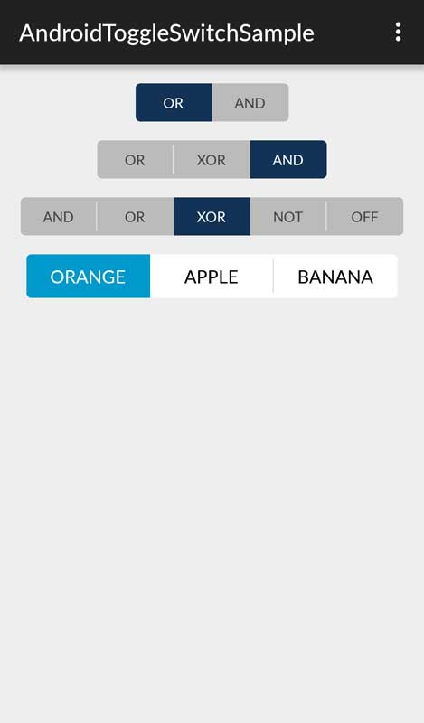
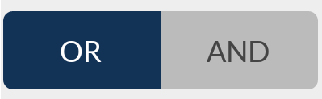
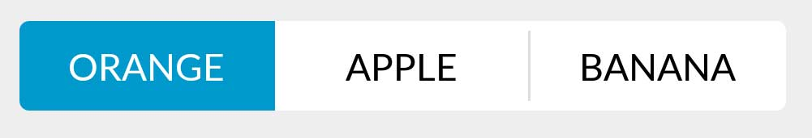

# Android-Toggle-Switch

A customizable extension of Android Switches that supports also more than 2 items.




## Installation

#### Gradle
Add Gradle dependency:

```
dependencies {
	compile 'us.belka:androidtoggleswitch:1.0'
}
```

#### Maven
```
<dependency>
  <groupId>us.belka</groupId>
  <artifactId>androidtoggleswitch</artifactId>
  <version>1.0</version>
  <type>pom</type>
</dependency>
```

## Usage

#### 2 Items 

```xml
<belka.us.androidtoggleswitch.widgets.ToggleSwitch
        android:layout_width="wrap_content"
        android:layout_height="wrap_content"
        custom:textToggleLeft="OR"
        custom:textToggleRight="AND"/>
```



#### 3 Items

```xml
<belka.us.androidtoggleswitch.widgets.ToggleSwitch
        android:layout_width="wrap_content"
        android:layout_height="wrap_content"
        custom:textToggleCenter="XOR"
        custom:textToggleLeft="OR"
        custom:textToggleRight="AND"/>
```


#### N - Items support

This can be accomplished only **programmatically**.

XML
```xml
<belka.us.androidtoggleswitch.widgets.ToggleSwitch
        android:layout_width="wrap_content"
        android:layout_height="wrap_content"
        android:layout_gravity="center"/>
```

JAVA code
```java
ToggleSwitch toggleSwitch = (ToggleSwitch) findViewById(R.id.multiple_switches);
ArrayList<String> labels = new ArrayList<>();
labels.add("AND");
labels.add("OR");
labels.add("XOR");
labels.add("NOT");
labels.add("OFF");
toggleSwitch.setLabels(labels);
```


NOTE: Providing a custom array of labels, the attributes textToggle[Left/Center/Right] will be ignored.

## Getters

Get the position of the current checked toggleSwitch.

```java
int position = toggleSwitch.getCheckedTogglePosition();
```


## Listeners

```java
ToggleSwitch toggleSwitch = (ToggleSwitch) findViewById(R.id.toggle_switch);
toggleSwitch.setOnToggleSwitchChangeListener(new ToggleSwitch.OnToggleSwitchChangeListener(){

            @Override
            public void onToggleSwitchChangeListener(int position) {
				// Write your code ... 
            }
        });
```

## Customizations

It is possible to customize the buttons applying the following options:


| Option Name      				| Format                 | Description                              |
| ---------------- 				| ---------------------- | -----------------------------            |
| android:textSize 				| `dimension`  	         | Text size of each button                 |
| custom:activeBgColor         | `color`               |  Background color of the checked button    |
| custom:activeTextColor       | `color`               | Text color of the checked button |
| custom:inactiveBgColor 		| `color`		         | Background color of the inactive buttons  |
| custom:inactiveTextColor     | `color`               | Text color of the inactive buttons       |
| custom:separatorColor        | `color`               | Color of the vertical separator between inactive buttons  |
| custom:toggleWidth    		| `dimension`           | Width of each button  |

#### Example

```xml
<belka.us.androidtoggleswitch.widgets.ToggleSwitch
        android:layout_width="wrap_content"
        android:layout_height="wrap_content"
        android:textSize="18sp"
        custom:activeBgColor="@android:color/holo_blue_dark"
        custom:activeTextColor="@android:color/white"
        custom:inactiveBgColor="@android:color/white"
        custom:inactiveTextColor="@android:color/black"
        custom:separatorColor="@color/gray_very_light"
        custom:textToggleCenter="APPLE"
        custom:textToggleLeft="ORANGE"
        custom:textToggleRight="BANANA"
        custom:toggleWidth="104dp"/>
```




## Contributors
Lorenzo Rigato, Android Developer @[Belka](https://github.com/BelkaLab)

## License
Android-Toggle-Switch is Copyright (c) 2016 Belka, srl. It is free software, and may be redistributed under the terms specified in the LICENSE file.  

## About Belka


[Belka](http://belka.us/en) is a Digital Agency specialized in design, mobile applications development and custom solutions.
We love open source software! You can [see our projects](http://belka.us/en/portfolio/) or look at our case studies.

Interested? [Hire us](http://belka.us/en/contacts/) to help build your next amazing project.

[www.belka.us](http://belka.us/en)
